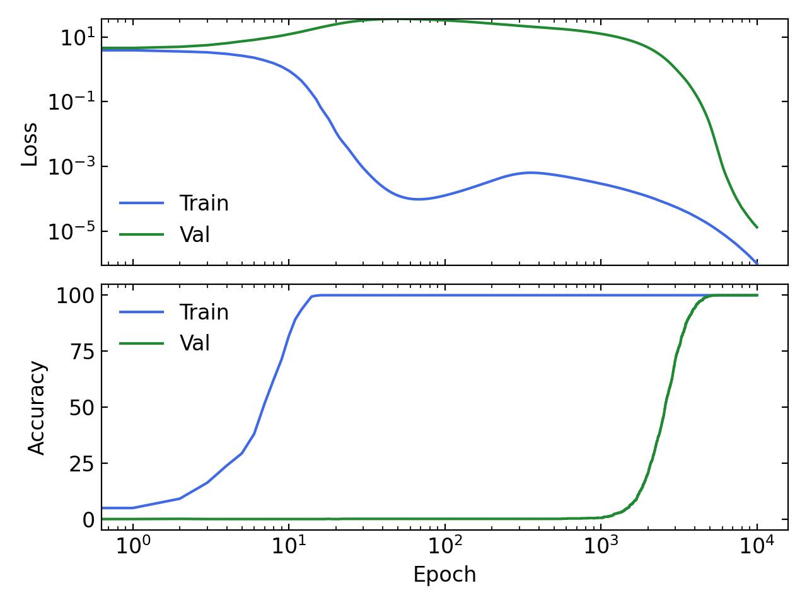

Minimal setup to observe the Grokking phenomenon on an algorithmic task. 
## Description
This is a minimal setup to observe Grokking (delayed generalization) on an algorithmic task.
The task is modular addition. The model is a simple 2-layer MLP that takes in two learnable embeddings of dimension `hidden_dim=128` concatenated together. Each embedding representes an integer and the target is their sum modulo 53.

## Run
Run `python train.py --grok` to see these training curves:

and `python train.py` for a more "normal" run:

The only difference between these two runs is that weight decay is set to 5 (!) in the non-grokking (comprehension) run and 0.03 in the grokking run. For more details on the effect of hyperparameters on the grokking phenomenon, see [this paper: Towards understanding grokking](https://arxiv.org/abs/2205.10343).

The ``--log`` option will log the training curves locally. ``python plot.py`` uses the logs in the `log/` folder to make the plots you see above.

## Requirements
You'll need `torch`, `numpy`, `matplotlib`, `tqdm`, and potentially `sklearn` if you want to use the `--anim` option for `plot.py` to animate the embeddings.