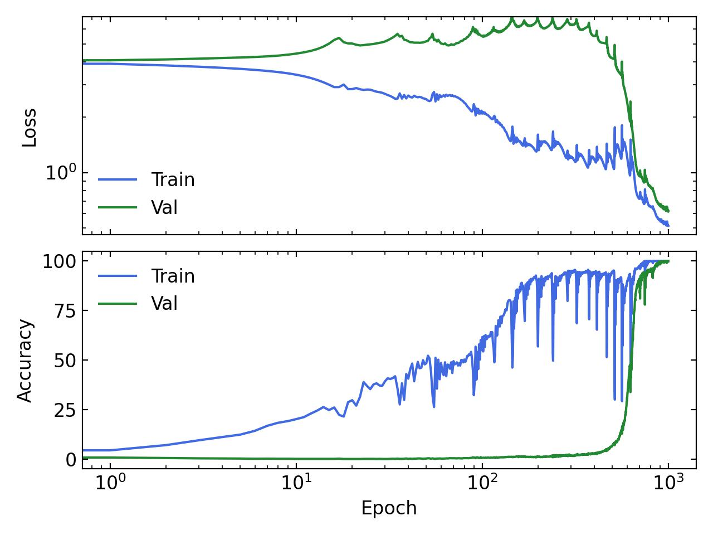

Minimal setup to observe the grokking phenomenon on an algorithmic task. 
## Description
This is a minimal setup to observe the grokking phenomenon on an algorithmic task.
The task is modular addition. The model is a simple 2-layer MLP which takes in two learnable embeddings of dimension `hidden_dim=128` concatenated together. Eeach embedding representes an integer and the target is their sum modulo 53.

## Run
Run `python train.py --grok` to see these training curves:

and `python train.py` for a normal run:
